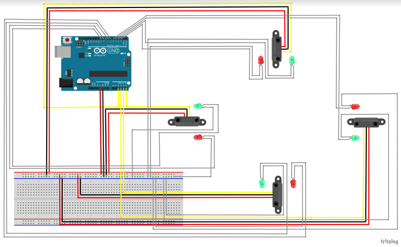
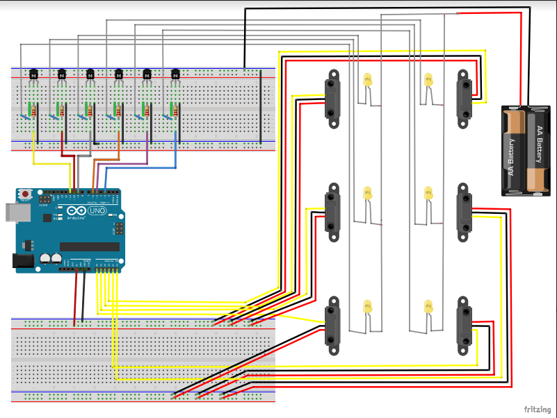
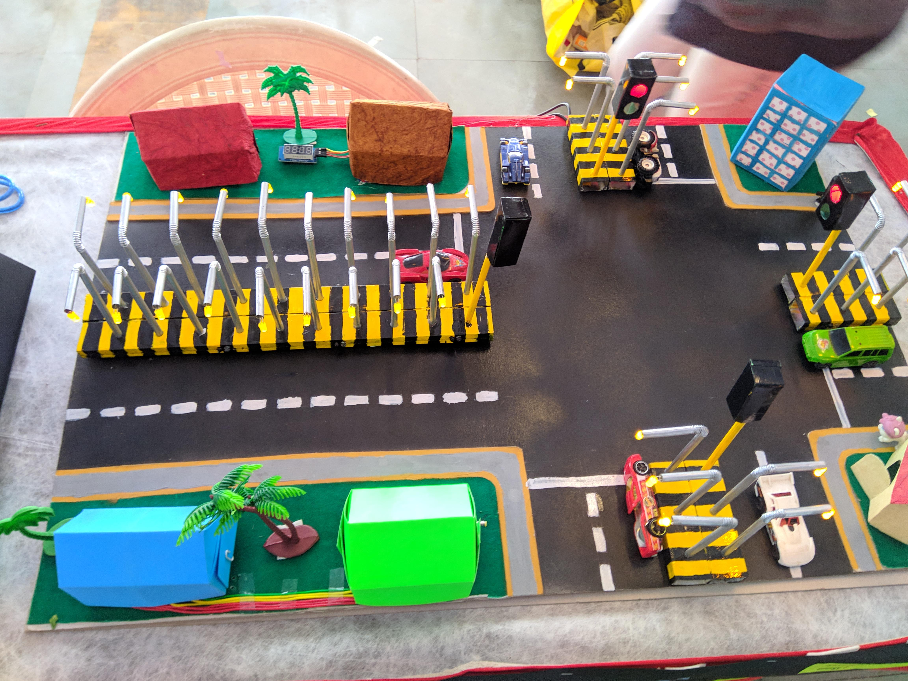

# Smart-Street-System

This simple little project uses an Arduino and some LEDs to replicate a traffic light and Smart street light, street light will turn on while vehiclhe is passing through it.here we are using 4 IR sensors that senses the position of the vehicle, each IR sensor controls 3 LED's. When vehicle passes by a particular IR sensor it senses the position of vehicle and gives its signal to the arduino board and it will turn on the LED's.

# Advantages
If we uses this idea and implement to it in our society it will be helpful in saving enough amount of electricity and off-course money.

# components neened
- arduino uno
- ir sensor (4)
- 10mm LEDs (6)
- connecting wire
- foam board

# Traffic light

Step one : settign up ardiuino

insert one side of the jumper wire into GND on the board. Lead the other side to the breadboard. Put it on the far right column on the breadboard, at the top. This is the ground column. ALL the way to the right. Take a look at the picture and/or the schematics if you don't understand.

Step two : Adding the LEDs

Take out your LEDs and resistors. Place one end of the resistor in the column on the right, the same column we connected our jumper wire to. Extend the other end of the breadboard into the main part of the breadboard. Attach the resistor to any row you like. Our LEDs will go on the same row. We will stick one end of the LED on one side of the breadboard, and the other end on the other side of the breadboard. The short end of the LED will go on the side your resistors are on, the right side. Extend the other end of the LED to the right side of the breadboard.

Step three: Completing the circuit

Alright. This is the last part. Take another jumper wire, put it on the same row that you have an LED on. This is where the wires will go:
Green LED: Port 2, Digital PWM section
Yellow LED, Port 3, Digital PWM section
Red LED, Port 4, Digital PWM section
If you don't understand, check the schematics are refer to the pictures.
Now, upload your code and you're finished!

# Street Light

To make these poles as given in above picture, use foam board and glue.
and you may also use black chart to make a road and wooden board for the base of pole.

# Finally

if all done correctly you will get an amazing result, bellow are some pictures of the project that i have made

